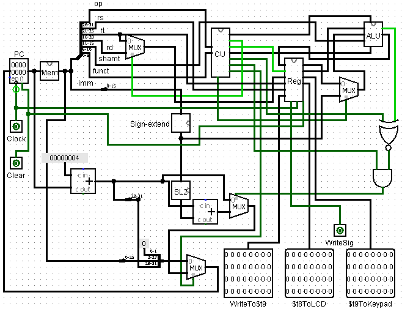
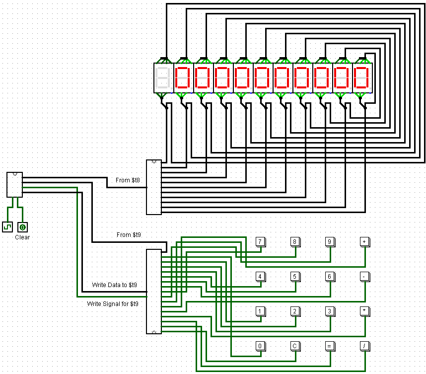

# Calculator_CPU
* A 32-bit MIPS processor that supports calculator code in MARS
* Affords addition, subtraction, multiplication, division
* The hardware part of the Project_Calculator repository

### Hardware Preview
##### CPU

##### Main

### Software Requirement
* MIPS Assembler and Run-time Simulator (aka MARS)
* Logisim-Generic-2.1.7 [download here](https://sourceforge.net/projects/circuit/files/2.7.x/2.7.1/logisim-generic-2.7.1.jar/download)

### Installation

1. Download the repository files from the download section or clone this project by typing in the bash the following command:

       git clone https://github.com/hw35/Calculator_CPU.git
3. Run MARS on the command line and open `simpleCalculator.asm` file in MARS.
4. Open **Tools** tab in MARS and click on **Simple Calculator**
5. Run the program :)

### Contributing
This project is done independently by me, but
- If you want to contribute new ideas, your pull request is welcomed!
- If you find any issue, feel free to add to the repository issue section.

## Thank You!
